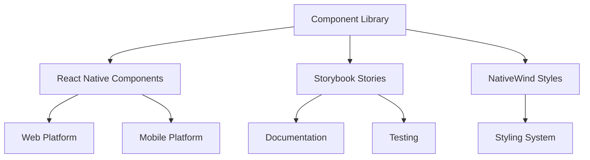

# System Patterns

## Architecture Overview

### Component Architecture



### Directory Structure

```
/
├── app/                 # App entry points
├── components/          # React Native components
├── stories/            # Storybook stories
├── lib/                # Utility functions
├── constants/          # Constants and configurations
├── hooks/              # Custom React hooks
├── assets/             # Static assets
└── .storybook/         # Storybook configuration
```

## Design Patterns

### 1. Component Pattern

- Functional components with TypeScript
- Props interface definition
- NativeWind styling
- Storybook documentation
- Component testing

### 2. Styling Pattern

- NativeWind classes
- Tailwind CSS utilities
- Theme customization
- Responsive design
- Dark mode support

### 3. Documentation Pattern

- Storybook stories
- Usage examples
- Props documentation
- Visual testing
- Interactive examples

### 4. Testing Pattern

- Unit tests
- Integration tests
- Visual regression tests
- Cross-platform tests
- Performance tests

## Technical Decisions

### 1. Framework Choices

- React Native for cross-platform
- Storybook for documentation
- NativeWind for styling
- TypeScript for type safety
- Expo for development

### 2. Development Workflow

- Hot reloading
- Development server
- Build process
- Testing environment
- Documentation updates

### 3. Performance Optimization

- Component optimization
- Bundle size reduction
- Render performance
- Development speed
- Build time optimization

### 4. Code Organization

- Modular architecture
- Clear file structure
- Consistent naming
- Type definitions
- Documentation standards

## Component Relationships

### 1. Component Dependencies

- Minimal dependencies
- Clear interfaces
- Type safety
- Documentation
- Testing coverage

### 2. Style Dependencies

- NativeWind integration
- Tailwind CSS utilities
- Theme system
- Responsive design
- Dark mode support

### 3. Documentation Dependencies

- Storybook integration
- Component stories
- Usage examples
- API documentation
- Visual testing

## Best Practices

### 1. Component Development

- Functional components
- TypeScript interfaces
- NativeWind styling
- Storybook documentation
- Component testing

### 2. Code Quality

- ESLint configuration
- TypeScript strict mode
- Code formatting
- Documentation
- Testing coverage

### 3. Performance

- Component optimization
- Bundle size
- Render performance
- Development speed
- Build time

### 4. Maintenance

- Clear documentation
- Version control
- Code review
- Testing
- Updates
